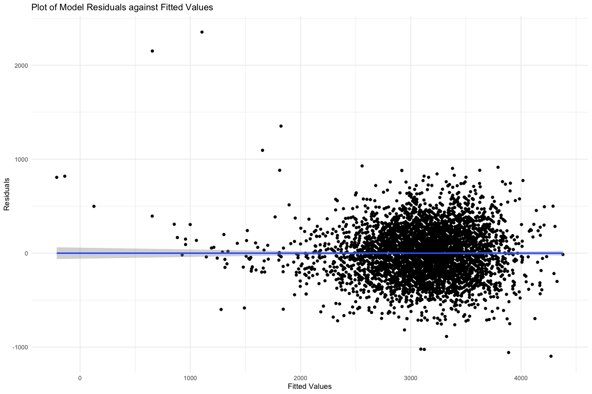

p8105 hw6 solutions
================
Shuhong Xiang
2020-12-09

### Problem 1

``` r
homicide_df = 
  read_csv("data/homicide-data.csv", na = c("", "NA", "Unknown")) %>% 
  mutate(
    city_state = str_c(city, state, sep = ", "),
    victim_age = as.numeric(victim_age),
    resolution = case_when(
      disposition == "Closed without arrest" ~ 0,
      disposition == "Open/No arrest"        ~ 0,
      disposition == "Closed by arrest"      ~ 1)
  ) %>% 
  filter(
    victim_race %in% c("White", "Black"),
    city_state != "Tulsa, AL") %>% 
  select(city_state, resolution, victim_age, victim_race, victim_sex)
```

    ## Parsed with column specification:
    ## cols(
    ##   uid = col_character(),
    ##   reported_date = col_double(),
    ##   victim_last = col_character(),
    ##   victim_first = col_character(),
    ##   victim_race = col_character(),
    ##   victim_age = col_double(),
    ##   victim_sex = col_character(),
    ##   city = col_character(),
    ##   state = col_character(),
    ##   lat = col_double(),
    ##   lon = col_double(),
    ##   disposition = col_character()
    ## )

tart with one city.

``` r
baltimore_df =
  homicide_df %>% 
  filter(city_state == "Baltimore, MD")
glm(resolution ~ victim_age + victim_race + victim_sex, 
    data = baltimore_df,
    family = binomial()) %>% 
  broom::tidy() %>% 
  mutate(
    OR = exp(estimate),
    CI_lower = exp(estimate - 1.96 * std.error),
    CI_upper = exp(estimate + 1.96 * std.error)
  ) %>% 
  select(term, OR, starts_with("CI")) %>% 
  knitr::kable(digits = 3)
```

| term              |    OR | CI\_lower | CI\_upper |
| :---------------- | ----: | --------: | --------: |
| (Intercept)       | 1.363 |     0.975 |     1.907 |
| victim\_age       | 0.993 |     0.987 |     1.000 |
| victim\_raceWhite | 2.320 |     1.648 |     3.268 |
| victim\_sexMale   | 0.426 |     0.325 |     0.558 |

Try this across cities.

``` r
models_results_df = 
  homicide_df %>% 
  nest(data = -city_state) %>% 
  mutate(
    models = 
      map(.x = data, ~glm(resolution ~ victim_age + victim_race + victim_sex, data = .x, family = binomial())),
    results = map(models, broom::tidy)
  ) %>% 
  select(city_state, results) %>% 
  unnest(results) %>% 
  mutate(
    OR = exp(estimate),
    CI_lower = exp(estimate - 1.96 * std.error),
    CI_upper = exp(estimate + 1.96 * std.error)
  ) %>% 
  select(city_state, term, OR, starts_with("CI")) 
```

``` r
models_results_df %>% 
  filter(term == "victim_sexMale") %>% 
  mutate(city_state = fct_reorder(city_state, OR)) %>% 
  ggplot(aes(x = city_state, y = OR)) + 
  geom_point() + 
  geom_errorbar(aes(ymin = CI_lower, ymax = CI_upper)) + 
  theme(axis.text.x = element_text(angle = 90, hjust = 1))
```


### Problem 2

Load and clean the dataset:

``` r
birthweight <- read_csv("data/birthweight.csv")
```

    ## Parsed with column specification:
    ## cols(
    ##   .default = col_double()
    ## )

    ## See spec(...) for full column specifications.

``` r
birthweight_df = 
 birthweight%>%
 janitor::clean_names() %>%
 mutate(babysex = 
    factor(
     case_when(
      babysex == 1 ~ "male",
      babysex == 2 ~ "female"
     )),
   frace = factor(
     case_when(
      frace == 1 ~ "White",
      frace == 2 ~ "Black",
      frace == 3 ~ "Asian",
      frace == 4 ~ "Puerto Rican",
      frace == 8 ~ "Other"
     )),
   malform = factor(
    case_when(
     malform == 0 ~ "absent",
     malform == 1 ~ "present"
    )),
   mrace = factor(
    case_when(
      mrace == 1 ~ "White",
      mrace == 2 ~ "Black",
      mrace == 3 ~ "Asian",
      mrace == 4 ~ "Puerto Rican",
      mrace == 8 ~ "Other"     
    ))
   )
```

#### Fist, I want to look at the overall model:

``` r
birthweight_df %>%
 lm(bwt ~ . , data = .) %>%
 broom::tidy()
```

    ## # A tibble: 25 x 5
    ##    term               estimate std.error statistic   p.value
    ##    <chr>                 <dbl>     <dbl>     <dbl>     <dbl>
    ##  1 (Intercept)       -6307.      659.      -9.57   1.80e- 21
    ##  2 babysexmale         -28.7       8.47    -3.39   7.02e-  4
    ##  3 bhead               131.        3.45    37.9    2.16e-271
    ##  4 blength              75.0       2.02    37.1    1.75e-261
    ##  5 delwt                 4.10      0.395   10.4    5.62e- 25
    ##  6 fincome               0.290     0.180    1.61   1.07e-  1
    ##  7 fraceBlack           -6.90     78.8     -0.0876 9.30e-  1
    ##  8 fraceOther          -16.9      97.6     -0.174  8.62e-  1
    ##  9 fracePuerto Rican   -68.2      78.5     -0.870  3.85e-  1
    ## 10 fraceWhite          -21.2      69.3     -0.306  7.59e-  1
    ## # … with 15 more rows

#### Besed on the coeffienct above, the both-way stepwise variable selction is used:

``` r
model_stepwise = lm(bwt ~ . , data = birthweight_df) 
step(model_stepwise, direction = "both") 
```

    ## Start:  AIC=48717.83
    ## bwt ~ babysex + bhead + blength + delwt + fincome + frace + gaweeks + 
    ##     malform + menarche + mheight + momage + mrace + parity + 
    ##     pnumlbw + pnumsga + ppbmi + ppwt + smoken + wtgain
    ## 
    ## 
    ## Step:  AIC=48717.83
    ## bwt ~ babysex + bhead + blength + delwt + fincome + frace + gaweeks + 
    ##     malform + menarche + mheight + momage + mrace + parity + 
    ##     pnumlbw + pnumsga + ppbmi + ppwt + smoken
    ## 
    ## 
    ## Step:  AIC=48717.83
    ## bwt ~ babysex + bhead + blength + delwt + fincome + frace + gaweeks + 
    ##     malform + menarche + mheight + momage + mrace + parity + 
    ##     pnumlbw + ppbmi + ppwt + smoken
    ## 
    ## 
    ## Step:  AIC=48717.83
    ## bwt ~ babysex + bhead + blength + delwt + fincome + frace + gaweeks + 
    ##     malform + menarche + mheight + momage + mrace + parity + 
    ##     ppbmi + ppwt + smoken
    ## 
    ##            Df Sum of Sq       RSS   AIC
    ## - frace     4    124365 320848704 48712
    ## - malform   1      1419 320725757 48716
    ## - ppbmi     1      6346 320730684 48716
    ## - momage    1     28661 320752999 48716
    ## - mheight   1     66886 320791224 48717
    ## - menarche  1    111679 320836018 48717
    ## - ppwt      1    131132 320855470 48718
    ## <none>                  320724338 48718
    ## - fincome   1    193454 320917792 48718
    ## - parity    1    413584 321137922 48721
    ## - mrace     3    868321 321592659 48724
    ## - babysex   1    853796 321578134 48727
    ## - gaweeks   1   4611823 325336161 48778
    ## - smoken    1   5076393 325800732 48784
    ## - delwt     1   8008891 328733230 48823
    ## - blength   1 102050296 422774634 49915
    ## - bhead     1 106535716 427260054 49961
    ## 
    ## Step:  AIC=48711.51
    ## bwt ~ babysex + bhead + blength + delwt + fincome + gaweeks + 
    ##     malform + menarche + mheight + momage + mrace + parity + 
    ##     ppbmi + ppwt + smoken
    ## 
    ##            Df Sum of Sq       RSS   AIC
    ## - malform   1      1447 320850151 48710
    ## - ppbmi     1      6975 320855679 48710
    ## - momage    1     28379 320877083 48710
    ## - mheight   1     69502 320918206 48710
    ## - menarche  1    115708 320964411 48711
    ## - ppwt      1    133961 320982665 48711
    ## <none>                  320848704 48712
    ## - fincome   1    194405 321043108 48712
    ## - parity    1    414687 321263390 48715
    ## + frace     4    124365 320724338 48718
    ## - babysex   1    852133 321700837 48721
    ## - gaweeks   1   4625208 325473911 48772
    ## - smoken    1   5036389 325885093 48777
    ## - delwt     1   8013099 328861802 48817
    ## - mrace     3  13540415 334389119 48885
    ## - blength   1 101995688 422844392 49908
    ## - bhead     1 106662962 427511666 49956
    ## 
    ## Step:  AIC=48709.53
    ## bwt ~ babysex + bhead + blength + delwt + fincome + gaweeks + 
    ##     menarche + mheight + momage + mrace + parity + ppbmi + ppwt + 
    ##     smoken
    ## 
    ##            Df Sum of Sq       RSS   AIC
    ## - ppbmi     1      6928 320857079 48708
    ## - momage    1     28660 320878811 48708
    ## - mheight   1     69320 320919470 48708
    ## - menarche  1    116027 320966177 48709
    ## - ppwt      1    133894 320984044 48709
    ## <none>                  320850151 48710
    ## - fincome   1    193784 321043934 48710
    ## + malform   1      1447 320848704 48712
    ## - parity    1    414482 321264633 48713
    ## + frace     4    124393 320725757 48716
    ## - babysex   1    851279 321701430 48719
    ## - gaweeks   1   4624003 325474154 48770
    ## - smoken    1   5035195 325885346 48775
    ## - delwt     1   8029079 328879230 48815
    ## - mrace     3  13553320 334403471 48883
    ## - blength   1 102009225 422859375 49906
    ## - bhead     1 106675331 427525481 49954
    ## 
    ## Step:  AIC=48707.63
    ## bwt ~ babysex + bhead + blength + delwt + fincome + gaweeks + 
    ##     menarche + mheight + momage + mrace + parity + ppwt + smoken
    ## 
    ##            Df Sum of Sq       RSS   AIC
    ## - momage    1     29211 320886290 48706
    ## - menarche  1    117635 320974714 48707
    ## <none>                  320857079 48708
    ## - fincome   1    195199 321052278 48708
    ## + ppbmi     1      6928 320850151 48710
    ## + malform   1      1400 320855679 48710
    ## - parity    1    412984 321270064 48711
    ## + frace     4    125020 320732060 48714
    ## - babysex   1    850020 321707099 48717
    ## - mheight   1   1078673 321935752 48720
    ## - ppwt      1   2934023 323791103 48745
    ## - gaweeks   1   4621504 325478583 48768
    ## - smoken    1   5039368 325896447 48773
    ## - delwt     1   8024939 328882018 48813
    ## - mrace     3  13551444 334408523 48881
    ## - blength   1 102018559 422875638 49904
    ## - bhead     1 106821342 427678421 49953
    ## 
    ## Step:  AIC=48706.02
    ## bwt ~ babysex + bhead + blength + delwt + fincome + gaweeks + 
    ##     menarche + mheight + mrace + parity + ppwt + smoken
    ## 
    ##            Df Sum of Sq       RSS   AIC
    ## - menarche  1    100121 320986412 48705
    ## <none>                  320886290 48706
    ## - fincome   1    240800 321127090 48707
    ## + momage    1     29211 320857079 48708
    ## + ppbmi     1      7479 320878811 48708
    ## + malform   1      1678 320884612 48708
    ## - parity    1    431433 321317724 48710
    ## + frace     4    124743 320761547 48712
    ## - babysex   1    841278 321727568 48715
    ## - mheight   1   1076739 321963029 48719
    ## - ppwt      1   2913653 323799943 48743
    ## - gaweeks   1   4676469 325562760 48767
    ## - smoken    1   5045104 325931394 48772
    ## - delwt     1   8000672 328886962 48811
    ## - mrace     3  14667730 335554021 48894
    ## - blength   1 101990556 422876847 49902
    ## - bhead     1 106864308 427750598 49952
    ## 
    ## Step:  AIC=48705.38
    ## bwt ~ babysex + bhead + blength + delwt + fincome + gaweeks + 
    ##     mheight + mrace + parity + ppwt + smoken
    ## 
    ##            Df Sum of Sq       RSS   AIC
    ## <none>                  320986412 48705
    ## + menarche  1    100121 320886290 48706
    ## - fincome   1    245637 321232048 48707
    ## + momage    1     11698 320974714 48707
    ## + ppbmi     1      8823 320977589 48707
    ## + malform   1      1884 320984528 48707
    ## - parity    1    422770 321409181 48709
    ## + frace     4    128726 320857686 48712
    ## - babysex   1    846134 321832545 48715
    ## - mheight   1   1012240 321998651 48717
    ## - ppwt      1   2907049 323893461 48743
    ## - gaweeks   1   4662501 325648912 48766
    ## - smoken    1   5073849 326060260 48771
    ## - delwt     1   8137459 329123871 48812
    ## - mrace     3  14683609 335670021 48894
    ## - blength   1 102191779 423178191 49903
    ## - bhead     1 106779754 427766166 49950

    ## 
    ## Call:
    ## lm(formula = bwt ~ babysex + bhead + blength + delwt + fincome + 
    ##     gaweeks + mheight + mrace + parity + ppwt + smoken, data = birthweight_df)
    ## 
    ## Coefficients:
    ##       (Intercept)        babysexmale              bhead            blength  
    ##         -6145.151            -28.558            130.777             74.947  
    ##             delwt            fincome            gaweeks            mheight  
    ##             4.107              0.318             11.592              6.594  
    ##        mraceBlack  mracePuerto Rican         mraceWhite             parity  
    ##           -63.906            -25.791             74.887             96.305  
    ##              ppwt             smoken  
    ##            -2.676             -4.843

According to the results of step-wise variable selection, then I choose
babysex, bhead, blength, mrace and parity as variable in my model.

Thus, build my model based on the five variables:

``` r
my_model = lm(formula = bwt ~ babysex + bhead + blength + mrace + parity, data = birthweight_df)
broom::glance(my_model)
```

    ## # A tibble: 1 x 12
    ##   r.squared adj.r.squared sigma statistic p.value    df  logLik    AIC    BIC
    ##       <dbl>         <dbl> <dbl>     <dbl>   <dbl> <dbl>   <dbl>  <dbl>  <dbl>
    ## 1     0.698         0.698  282.     1432.       0     7 -30648. 61315. 61372.
    ## # … with 3 more variables: deviance <dbl>, df.residual <int>, nobs <int>

Plot residuals against fitted values of my model:

``` r
plot_my_model = 
  birthweight_df %>%  
  modelr::add_residuals(my_model) %>% 
  modelr::add_predictions(my_model) %>%
  ggplot(aes(x = pred, y = resid)) + 
  geom_point() +
  geom_smooth(formula = y ~ x, method = "lm") + 
  labs(
    title = "Plot of model residuals against fitted values",
    x = "Fitted Values",
    y = "Residuals"
  )

plot_my_model
```



### Problem 3

Load the dataset:

``` r
weather_df = 
  rnoaa::meteo_pull_monitors(
    c("USW00094728"),
    var = c("PRCP", "TMIN", "TMAX"), 
    date_min = "2017-01-01",
    date_max = "2017-12-31") %>%
  mutate(
    name = recode(id, USW00094728 = "CentralPark_NY"),
    tmin = tmin / 10,
    tmax = tmax / 10) %>%
  select(name, id, everything())
```

    ## Registered S3 method overwritten by 'hoardr':
    ##   method           from
    ##   print.cache_info httr

    ## using cached file: /Users/ShuhongXiang/Library/Caches/R/noaa_ghcnd/USW00094728.dly

    ## date created (size, mb): 2020-12-08 10:05:45 (7.536)

    ## file min/max dates: 1869-01-01 / 2020-12-31

#### Set up bootstrap and show the results of bootstrap:

``` r
set.seed(1)
bootstrap_weather = 
 modelr::bootstrap(weather_df, n = 5000, id = "id") %>%
 mutate(
  lm_model = map(strap, ~lm(tmax ~ tmin, data = .x) ),
  lm_model_summary = map(lm_model, broom::tidy),
  lm_model_glance = map(lm_model, broom::glance)
  ) %>% 
  unnest(lm_model_summary,lm_model_glance) %>% 
  select(id, term, estimate, r.squared)

bootstrap_weather %>% 
 head() %>% 
 knitr::kable()
```

| id   | term        | estimate | r.squared |
| :--- | :---------- | -------: | --------: |
| 0001 | (Intercept) | 7.454152 | 0.9066105 |
| 0001 | tmin        | 1.034899 | 0.9066105 |
| 0002 | (Intercept) | 7.358860 | 0.8958830 |
| 0002 | tmin        | 1.034589 | 0.8958830 |
| 0003 | (Intercept) | 7.478616 | 0.9178528 |
| 0003 | tmin        | 1.040491 | 0.9178528 |

#### Plot the distribution of r^2 and 2.5% and 97.5% quantiles to provide a 95% confidence interval:

``` r
bootstrap_weather %>%
  ggplot(aes(x = r.squared)) +
  geom_density()+
  labs(
    title = "The Distribution of r^2",
    x = "r^2 value"
  )
```


``` r
bootstrap_weather %>%
  summarize(
    Estimate = "r^2",
    CI_lower = quantile(r.squared, 0.025), 
    CI_upper = quantile(r.squared, 0.975)
    ) %>% 
 knitr::kable(caption = "95% CI of r^2")
```

| Estimate | CI\_lower | CI\_upper |
| :------- | --------: | --------: |
| r^2      | 0.8936684 |  0.927106 |

95% CI of r^2

#### Calculate the value of log(beta\_0 \* beta\_1) and plot the distribution. Then, 2.5% and 97.5% quantiles to provide a 95% confidence interval:

``` r
bootstrap_weather %>%
  select(id, term, estimate) %>%
  pivot_wider(names_from = term,
              values_from = estimate) %>%
  mutate(
   log_value = log(tmin * `(Intercept)`)
   ) %>%
  ggplot(aes(x = log_value)) +
  geom_density() +
  labs(
    title = "Distribution of log(beta_0 * beta_1)",
    x = "log(beta_0 * beta_1)"
  )
```


``` r
bootstrap_weather %>%
  select(id, term, estimate) %>%
  pivot_wider(names_from = term,
              values_from = estimate) %>%
  mutate(
   log_value = log(tmin * `(Intercept)`)
   ) %>%
  summarise(
    Estimate = "log(beta_0 * beta_1)",
    CI_lower = quantile(log_value, 0.025), 
    CI_upper = quantile(log_value, 0.975)
    ) %>% 
 knitr::kable(caption = "95% CI of log(beta_0 * beta_1)")
```

| Estimate                | CI\_lower | CI\_upper |
| :---------------------- | --------: | --------: |
| log(beta\_0 \* beta\_1) |  1.964949 |  2.058887 |

95% CI of log(beta\_0 \* beta\_1)

From the graphs pf distribution above, we can see the distribution of R
square is basically normal and mean is about 0.91. Besides, the the plot
of log(beta\_0 \* beta\_1) shows that the value of the value of
log(beta\_0 \* beta\_1) is also normally distributed around the 2.03.
